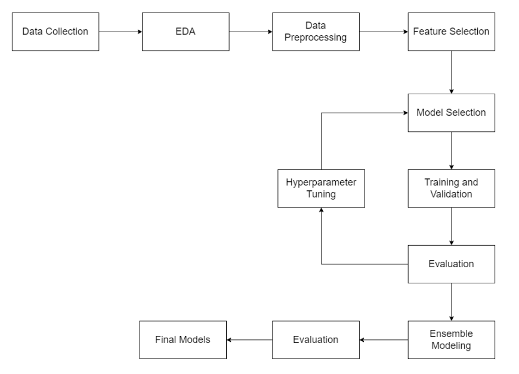
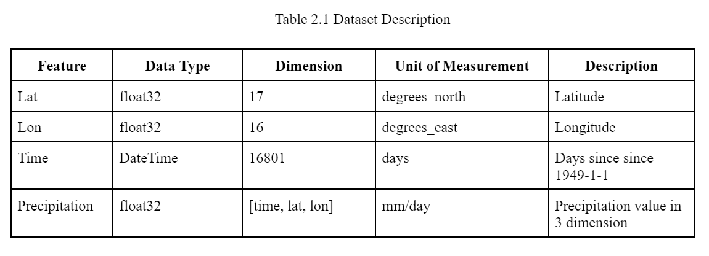
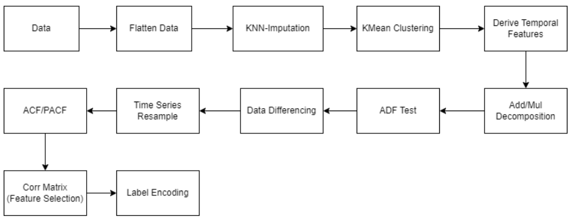
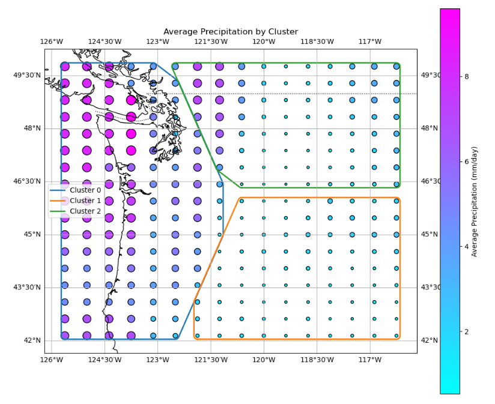
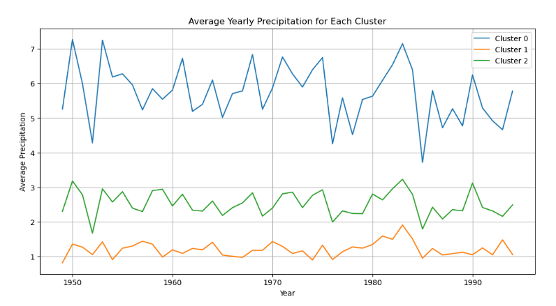
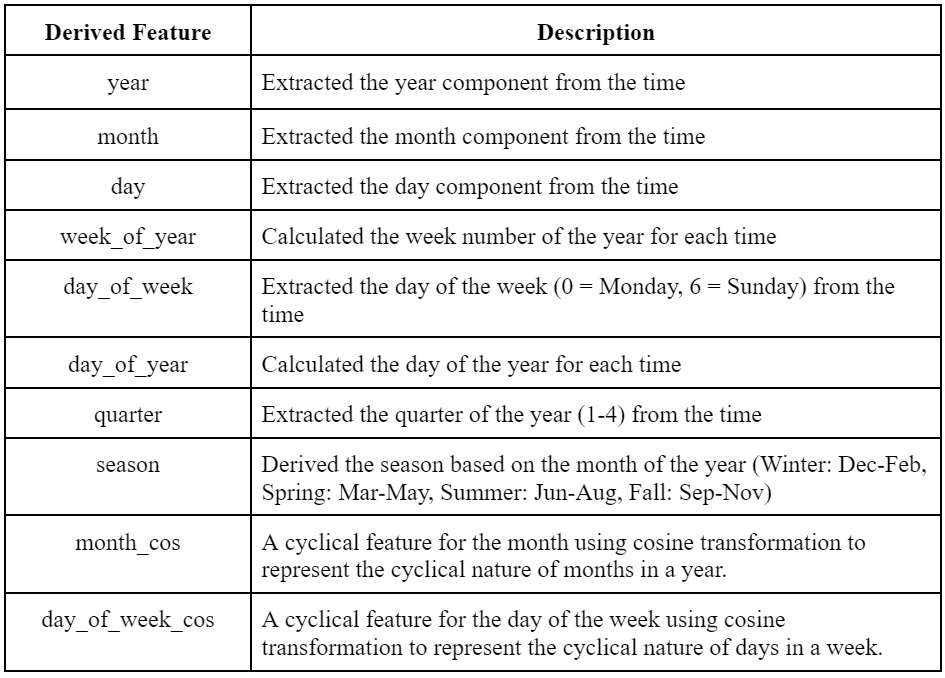
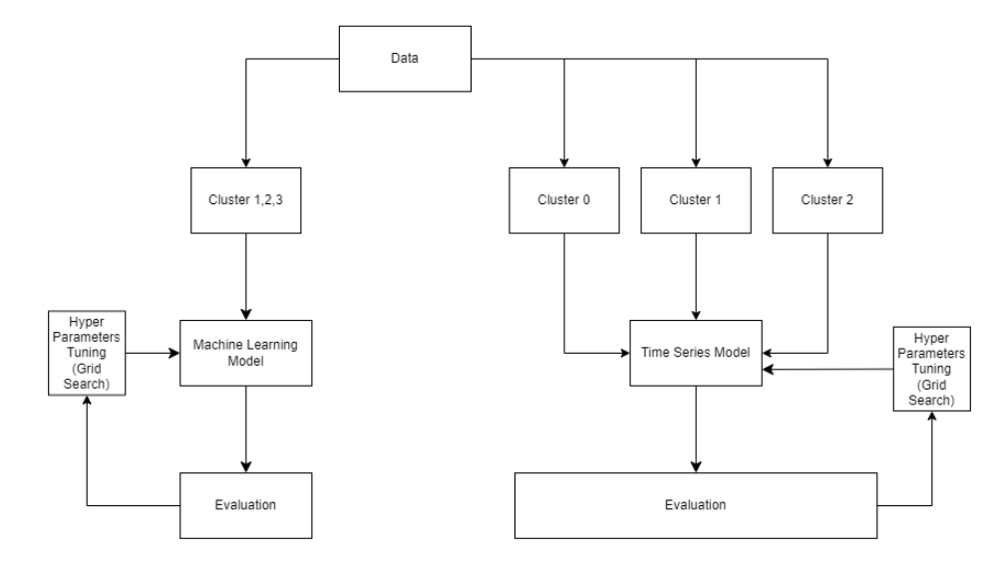
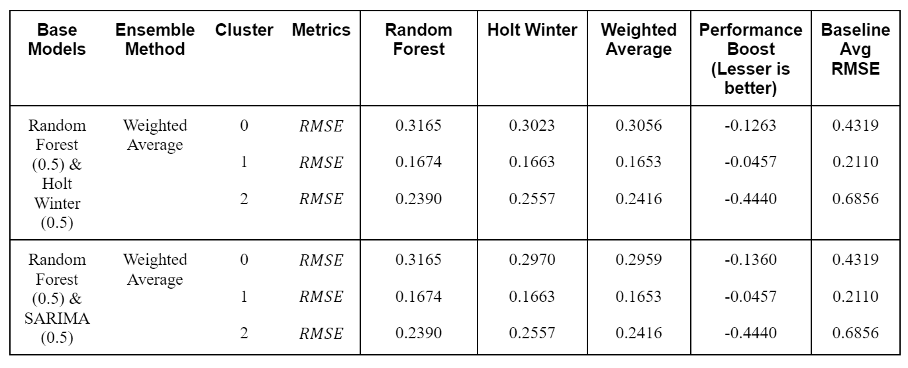
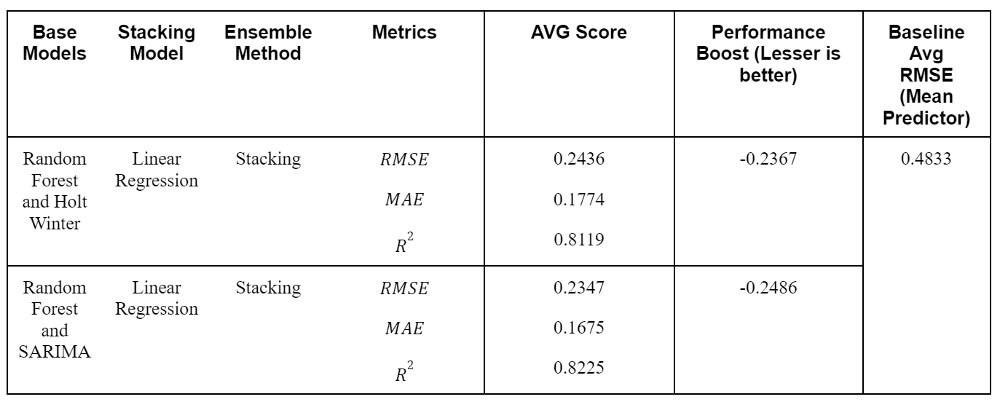

# Precipitation forecast

This project focuses on training machine learning models to predict precipitation values in Pacific Northwest. 

Overall workflow

## Dataset

The dataset is "50" km resolution daily precipitation for the Pacific Northwest, 1949-94 provided by Martin Widmann and Christopher Bretherton of the University of Washington : http://research.jisao.washington.edu/data_sets/widmann/

## Data Preprocessing

Data Preprocessing workflow

To reduce the dimension of data, a total of 272 locations with 17 latitude and 16 longitude in pacific northwest are clustered into 3 clusters with k means clustering algorithm.

Temporal Features

## Model Training 

3 Time Series models and 3 Non-Time Series models were trained to forecast precipitation

Time Series Models:
1. ARIMA
2. SARIMA
3. Exponential Smoothing (Holt Winter)

Non-Time Series Models:
1. Linear Regression
2. Random Forest
3. XGBoost

## Ensemble Modeling 
reference : https://www.analyticsvidhya.com/blog/2018/06/comprehensive-guide-for-ensemble-models/

Best Performance models are ensemble via weighted average (0.5 each model) and model stacking with Linear Regression. 

